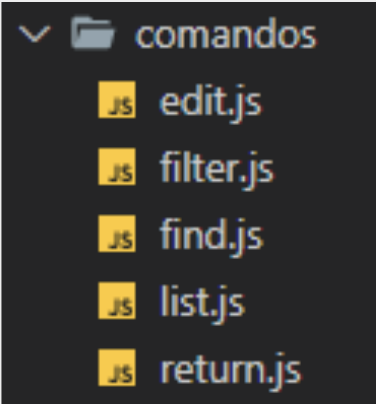
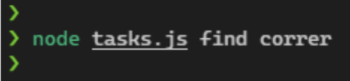

# **Módulo 1: Introducción a la programación**
## **Clase 5: Aplicación de tareas 1.0.0** ⚡️
--- 

1. Crear un archivo `tasksData.js` que contendrá nuestras tareas.
La idea es que contenga en una variable/constante `tasks` (que exportaremos para consumir en otro archivo) todas las tareas en formato de un **arreglo de objetos literales**, donde cada tarea es un objeto literal y en su conjunto conforman el arreglo de tareas.  
Cada tarea deberá tener **dos propiedades**: `title` (título) y `desc` (descripción), ambas de tipo _string_.

 

---
 
2. Crear un directorio llamado `funcionalidades` o `comandos` donde ubicaremos las distintas funciones que dispararán las acciones de nuestra aplicación. Estas funcionalidades deberán ser un archivo con un nombre descriptivo para cada una, por ejemplo: `filter.js`.

 

  

 

---
 

3. Dentro de la carpeta `comandos` (le llamaremos comandos de aquí en adelante para simplificar) debemos incluir el código para que cada una de estas funcionalidades cumpla con su propósito. Estas funciones serán disparadas desde nuestro **entry point**, archivo llamado `tasks.js`, que deberemos crear **en la raíz de nuestro proyecto**.

 

---
 

4. Archivo `list.js`: esta funcionalidad deberá **retornar el listado completo de las tareas**. Para ello, deberá leer por supuesto el listado completo, recorrerlo y retornar solamente los títulos de cada tarea, no su descripción, como un **arreglo de strings**.
Vale aclarar, que para que podamos leer el listado de tareas deberemos importarlo desde cada archivo donde lo necesitemos, como por ejemplo en este archivo. Esto es algo que deberemos repetir **en cada archivo** dentro de comandos.

 

---
 

5. Archivo `find.js`: esta funcionalidad **recibirá un título de una tarea como parámetro** y deberá retornar un `true` o `false` dependiendo de si encuentra o este parámetro dentro del listado de tareas .

 

---
 

6. Archivo `edit.js`: esta funcionalidad aún no estará al 100% en esta etapa. Pero ya la dejaremos creada para futuras iteraciones de nuestra app. **Deberá recibir dos parámetros**: el primero es el `título` de la tarea a editar, y el segundo es la nueva `descripción` de la tarea a editar. Como esta funcionalidad no hará nada realmente aún, simplemente deberá **devolver un objeto literal que contenga la información que a futuro se guardaría en la tarea**.

 

---
 

7. Archivo `filter.js`: esta funcionalidad hace algo similar al `find.js`, pero en vez de retornar si encontró el valor que se le pasa por parámetro o no, esta función **deberá retornar todas las tareas que contengan, en su título, lo que se le pasa por parámetro a la función**.
>Si tenemos tres tareas: _correr_, _comer_ y _saltar_, y llamamos la función pasándole por parámetro el string “co”( `filter(‘co’)` ), esta funcionalidad debería retornar un arreglo con las primeras dos tareas (correr y comer), ya que sólo estas dos contienen el _string_ “co” dentro del título.

 

---
 

8. Archivo `return.js`: esta funcionalidad **recibirá un título por parámetro** (_string_) y, en caso de que ese título coincida con alguno de los que existen dentro del listado, **deberá retornar la descripción que corresponde a esa tarea**.

 

---
 

9. Finalmente trabajaremos en nuestro **entry point**: el archivo `tasks.js`.
Dentro de este deberemos crear el código necesario para que, al correr nuestra aplicación utilizando comandos adicionales, puedan **lanzarse las funcionalidades que fuimos creando anteriormente**.
>Si pasamos, por ejemplo, como primer parámetro adicional la palabra _find_, deberá dispararse la función del archivo `find.js` utilizando el segundo parámetro adicional como parámetro de búsqueda.  
>La estructura `switch` puede resultar muy útil.

 

  
