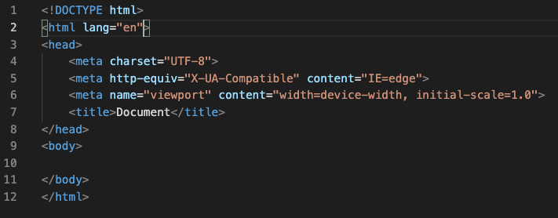

# **Módulo 2: Introducción al Front-End**
## **Clase 2: Etiquetas y estilos básicos**
--- 
<br>
<br>




> Para mayor facilidad en la lectura y la estructuración del documento, el documento HTML se escribe con _indentación_ (sangría).

<br>

### **Etiquetas HTML**

¡Hagamos un repaso por las etiquetas más comunes de HTML!

<br>

#### `<html>`
Esta etiqueta va a contener a todas las demás etiquetas dentro de sí. Básicamente, sirve para avisarle al navegador que el contenido debe ser interpretado como **html**.

---
<br>

#### `<head>`
Esta etiqueta sirve para contener otras etiquetas que almacenen información sobre el documento, pero es información **que no queremos que se muestre** en el viewport. Comúnmente, contiene el título de la página y los enlaces a recursos externos, como por ejemplo, una hoja de estilos.

---
<br>

#### `<title>`
Es el título de la página, **se mostrará en la pestaña del navegador** o en la parte superior.

---
<br>

#### `<body>`
En esta etiqueta estará contenido todo aquello que querramos **que se vea en la pantalla**.
>Todas las etiquetas que veamos a continuación deberán ir dentro del cuerpo (body) de nuestro documento, puesto que queremos que se vean en nuestra página. 

---
<br>


#### `<p>`
Es la etiqueta para los **párrafos**. Mostrará el texto contenido dentro en una nueva línea cada vez que se coloque.
```html
<p>Soy un párrafo</p>
````

---
<br>

#### `<span>`
El elemento span es un contenedor de **texto genérico**. No inserta una nueva línea, como sí lo hace el elemento `<p>`.
```html
<span>Contengo texto genérico</span>
````

---
<br>

#### `<a>`
El elemento a, del inglés _anchor_ (ancla) es un "anclaje" o **enlace** hacia otro elemento en el mismo documento, otro archivo html o a otro sitio web, cosa que hace a través del elemento `href`. Podemos pedirle que lo haga en la misma pestaña del navegador o en una nueva, mediante el atributo `target`.
```html
<!-- Enlace a web externa -->
<a href="https://icaro.org.ar/">Visita a la web oficial de Icaro</a>

<!-- Enlace a web externa en una nueva pestaña -->
<a href="https://icaro.org.ar/" target="_blank">Visita a la web oficial de Icaro</a>

<!-- Enlace a otro documento html -->
<a href="./galeria.html">Visita la Galería</a>
````

---
<br>

#### ``
Esta etiqueta nos permite mostrar imágenes en la pantalla. Necesita el atributo `src`, que indica la URL de donde sacar la imagen a mostrar, o la dirección específica de un archivo de imagen en nuestra computadora. Mediante los atributos `width` y `height` podemos especificar su tamaño. La etiqueta `alt` no es exclusiva de esta etiqueta, pero sirve en ella para mostrar texto alternativo: aquél que se mostrará para los lectores de accesibilidad de pantalla y en aquéllos casos en los cuales la imagen falle en mostrarse.

```html


````

---
<br>

#### `<div>`
Un `div` (divisor) es un **contenedor genérico**. Es usado principalmente para dar estilo. Imaginen que es una caja, cuyo tamaño y color se puede modificar a gusto. Como es un contenedor, puede contener, además, otros `div` dentro de sí.

```html
<!-- divisor externo -->
<div>
    <p>Soy un párrafo contenido en un divisor</p>
    <!-- divisor interno -->
    <div>
        <span>Yo soy texto genérico, contenido dentro de un contenedor, ¡que a su vez está dentro de otro contenedor!
    </div>
</div>

````

---
<br>


#### `<ul>`
La lista desordenada, o _unordered list_ es un elemento HTML que permite establecer texto acompañado por viñetas. Está diseñado para contener otras etiquetas, de tipo `<li>`, dentro de la cual cada una representa un _item_, o elemento de lista.

```html
<!-- lista genérica -->
<ul>
    <li>Item #1</li>
    <li>Item #2</li>
    <li>
        <span>Se pueden anidar otras etiquetas dentro de los elementos de lista</span>
    </li>
    <li>Item #3</li>
</ul>

````

---
<br>


#### `<br>`
La etiqueta _break row_ produce un salto de línea en el texto, independientemente de si el elemento es un elemento de bloque o un elemento en línea. Es considerada una **mala práctica** recurrir al salto de línea para incrementar el espacio entre dos elementos, para lo cual existen propiedades específicas de CSS. Resulta útil al querer mostrar, por ejemplo, un poema o una dirección postal.

```html
<!-- Es útil para casos en los que el salto de línea mejora la legibilidad-->
<span>Av. Siempreviva 742</span>
<br>
<span>Springfield, US.</span>
````

---
<br>


#### `headings`
Los encabezados son las etiquetas de títulos. Se utilizan para ordenar el documento, estableciendo jerarquía por tamaños: del 1 al 6, podemos pensarlos como el título y los subtítulos de cada sección o contenido.

```html
<h1>Título enorme</h1>
<h2>Título grande</h2>
<h3>Título moderado</h3>
<h4>Título pequeño</h4>
<h5>Título diminuto</h5>
<h6>Título ínfimo</h6>
```

<br>

### **Estilos CSS**

¡Hagamos un repaso por los estilos más comunes de CSS!

<br>

#### `color` y `background-color`
Estas propiedades permiten cambiar el color del elemento y el color de fondo del elemento, respectivamente. El color se puede indicar de diferentes maneras:

1. Indicando el nombre del color en inglés
```css
p {
    color: white;
    background-color: black;
}
```

---
<br>

2. Utilizando el **sistema hexadecimal**. En este sistema, se toma como referencia la combinación de tres colores: **rojo, verde y azul** (_Red, Green and Blue_, por sus siglas en inglés). Un valor expresado en el sistema hexadecimal admite, en este caso, dos cifras para cada color en el orden mentado, por ende, al definir el color obtendremos **un número de seis cifras** a continuación del `#` numeral (_hashtag_); las primeras dos cifras corresponden al valor que se le dará al rojo, las dos cifras del medio, al valor del verde y el último par de cifras, al del azul. Cabe recordar que, en el sistema hexadecimal, el cero representa la ausencia total de una propiedad y la `#F`, su valor más alto.
```css
p {
    color: #FFFFFF; /* blanco */
    background-color: #000000; /* negro */
}
```
> Una abreviación en la notación de este sistema nos permite escribir menos caracteres. Si un par de cifras referentes al mismo color son iguales, alcanza con escribir únicamente una vez ese número o letra. Abreviado así, podría obtenerse el mismo resultado al escribir `#FFF` para blanco y `000` para negro.
---
<br>

3. Utilizando una **función RGB**. La función RGB acepta tres parámetros. Estos son números enteros que van del 0 (ausencia absoluta) al 255 (presencia total), inclusive. En una función RGB, el orden de los valores se asigna al rojo, verde y azul, tal como su nombre lo indica:
```css
p {
    color: rgb(255, 255, 255); /* blanco */
    background-color: rgb(0, 0, 0); /* negro */
}
```
>Esta función RGB también puede aceptar un cuarto parámetro: `a`. Este parámetro representa la **opacidad** del color resultante y se expresa a través de un número que va desde el cero al uno. De esta forma, representar el blanco es igual a colocar el parámetro alfa en cero y el negro, en uno `rgba(x, x, x, 1)`.
---
<br>

4. Hay una forma más de indicar colores: es esta por medio de otra función, denominada **HSL** (_hue, saturation and lightness_). HSL acepta tres parámetros, cada uno representando el grado del color (H), la saturación (S) y la iluminación.  
`Hue` va de 0 a 360º, donde de 0 a 119º se representa el rojo, de 120º a 239º, el verde y de 240º a 360º, el azul.  
Los valores restantes, `Saturation` y `Lightness` representan porcentajes, medidas de posición que van de 0 a 100%.
```css
p {
    color: hsl(0, 100%, 50%); /* rojo */
    background-color:  hsl(120, 100%, 50%); /* verde */
}
```
---
<br>
<br>

#### `texto en CSS`
Para la manipulación el texto de nuestro documento HTML, CSS tiene propiedades que nos permiten modificar:

- La **alineación**, a través de `text-align`, cuyos valores son:
    - left (izquierda)
    - center (centro)
    - right (derecha)
    - justify (justificada)
    
    <br>

- El **tamaño**, mediante `font-size`, que admite cualquier valor expresado en números enteros, expresados en una gran cantidad de unidades de medida, algunas de las más populares son:
    - px: píxeles
    - em: un em equivale a las pulgadas nominales de la fuente en cuestión.
    - rem: (_root em_) equivale a las pulgadas nominales de la fuente, sólo que toma como referencia su contenedor raíz –_root_–, inmediato)
    - %: porcentaje

<br>

- El **tipo de fuente**, a través de `font-family`. Admite muchos valores, tantos como tipografías haya disponibles en el ordenador al momento de reglar los estilos. Suele sugerirse establecer más de un tipo de fuente –separado con comas– para tener una o más fuentes alternativas, en caso de que el navegador que acceda al archivo no cuente con el primer tipo de fuente como opción.

- El **grosor**, mediante `font-weight`, cuyos valores pueden ser:
   
    - normal (valor por defecto)
    - light (suave)
    - bold (grueso)
    - 900
